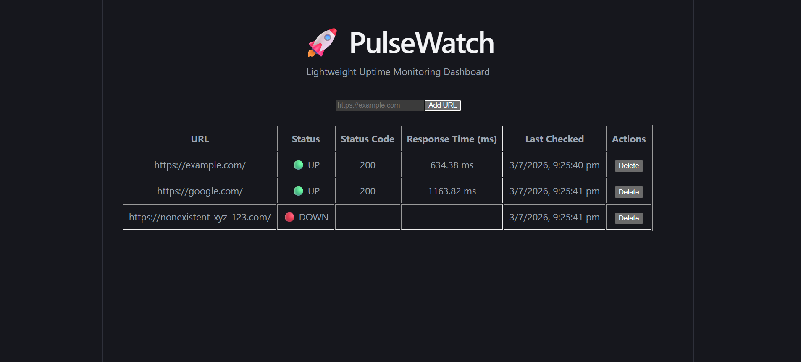
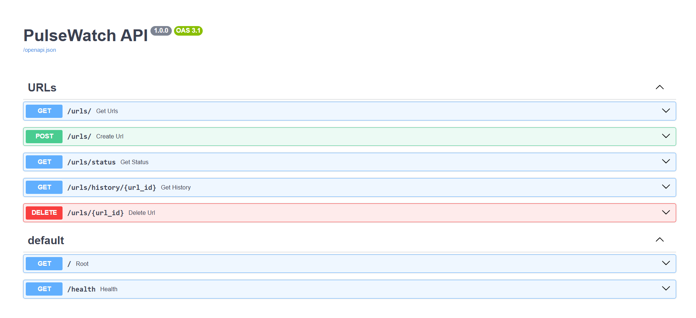
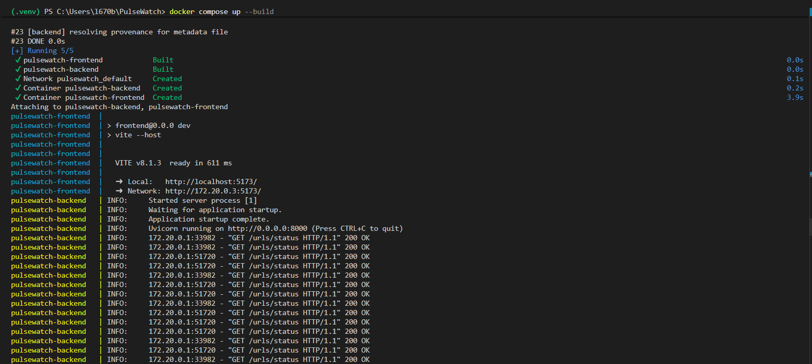

# 🚀 PulseWatch

> Lightweight full-stack uptime monitoring platform built with FastAPI, React, SQLite, Docker, and AI-assisted development.

PulseWatch periodically monitors registered URLs and displays their operational status, response times, and latest health checks through a real-time dashboard.

---

# 📌 Assignment Objective

This project was developed as part of a full-stack engineering assignment to demonstrate:

- Backend API development
- Frontend integration
- Database design
- Docker containerization
- End-to-end system thinking
- Effective collaboration with AI development tools

The goal was to build a minimal but complete uptime monitoring system that can be launched locally with a single command.

---

# 🎥 Demo Screenshots

## Dashboard



---

## API Documentation



---

## Dockerized Application



---

# ✨ Features

## Backend

✅ Register URLs for monitoring

✅ Periodic health checks using APScheduler

✅ Store:

- HTTP Status Code
- Response Time
- Timestamp
- Availability Status

✅ View latest URL status

✅ View historical health checks

✅ Delete monitored URLs

---

## Frontend

✅ Real-time dashboard

✅ Add new URLs

✅ View:

- URL
- Status
- Status Code
- Response Time
- Last Checked Time

✅ Delete URLs

✅ Automatic refresh every 5 seconds

---

## Infrastructure

✅ Dockerized frontend

✅ Dockerized backend

✅ Single-command startup

```bash
docker compose up --build
```

---

# 🏗 System Architecture

```text
                   ┌─────────────────┐
                   │   React Frontend │
                   └────────┬────────┘
                            │
                            │ REST API
                            │
                   ┌────────▼────────┐
                   │ FastAPI Backend │
                   └────────┬────────┘
                            │
                            │ SQLAlchemy ORM
                            │
                   ┌────────▼────────┐
                   │ SQLite Database │
                   └────────┬────────┘
                            │
                            │
                   ┌────────▼────────┐
                   │ APScheduler Job │
                   └─────────────────┘
```

---

# ⚙️ Tech Stack

## Backend

| Technology | Purpose |
|------------|----------|
| FastAPI | REST API |
| SQLAlchemy | ORM |
| SQLite | Database |
| APScheduler | Background Monitoring |
| Requests | HTTP Monitoring |

---

## Frontend

| Technology | Purpose |
|------------|----------|
| React | UI |
| Vite | Build Tool |
| Axios | API Communication |

---

## DevOps

| Technology | Purpose |
|------------|----------|
| Docker | Containerization |
| Docker Compose | Multi-container orchestration |

---

# 📂 Repository Structure

```text
PulseWatch
│
├── backend
│   ├── app
│   │   ├── routers
│   │   ├── services
│   │   ├── models.py
│   │   ├── database.py
│   │   ├── scheduler.py
│   │   └── main.py
│   ├── Dockerfile
│   └── requirements.txt
│
├── frontend
│   ├── src
│   │   ├── components
│   │   ├── App.jsx
│   │   └── api.js
│   ├── Dockerfile
│   └── package.json
│
├── docs
│   ├── dashboard.png
│   ├── swagger.png
│   └── docker.png
│
├── docker-compose.yml
├── README.md
└── AI_LOG.md
```

---

# 🗄 Database Schema

## monitored_urls

| Column | Type |
|--------|------|
| id | Integer |
| url | String |
| created_at | DateTime |

---

## health_checks

| Column | Type |
|--------|------|
| id | Integer |
| url_id | Integer |
| status_code | Integer |
| response_time | Float |
| is_up | Boolean |
| checked_at | DateTime |

---

# 🚀 Running Locally

## Prerequisites

- Docker
- Docker Compose

---

## Start Everything

```bash
docker compose up --build
```

---

# 🌐 Access URLs

Frontend:

```text
http://localhost:5173
```

Backend:

```text
http://localhost:8001
```

Swagger:

```text
http://localhost:8001/docs
```

---

# 🧪 Verification Steps

## Healthy URL

Add:

```json
{
  "url": "https://example.com"
}
```

Expected:

```text
🟢 UP
Status Code: 200
Response Time: <value>
```

---

## Another Healthy URL

```json
{
  "url": "https://google.com"
}
```

Expected:

```text
🟢 UP
```

---

## Broken URL

```json
{
  "url": "https://nonexistent-xyz-123.com"
}
```

Expected:

```text
🔴 DOWN
Status Code: -
Response Time: -
```

---

# 📡 API Endpoints

| Method | Endpoint | Description |
|---------|-----------|-------------|
| GET | /urls | Get all URLs |
| POST | /urls | Add URL |
| GET | /urls/status | Latest status |
| GET | /urls/history/{id} | Health history |
| DELETE | /urls/{id} | Delete URL |

---

# 🐳 Docker Design

```text
Docker Network
│
├── Frontend Container
│
└── Backend Container
        │
        └── SQLite Database
```

---

# ☁️ Deployment Sketch

For an MVP deployment:

```text
AWS EC2
│
├── Docker Compose
│
├── Frontend Container
├── Backend Container
└── Persistent Volume
```

## Production Evolution

- PostgreSQL instead of SQLite
- ECS or Kubernetes
- Nginx reverse proxy
- HTTPS
- CloudWatch logging
- Health alert notifications

---

# Challenges Faced During Development

## Database Migration Issue

Error:

```text
sqlite3.OperationalError:
table health_checks has no column named is_up
```

Resolution:

- Recreated database schema.

---

## Docker Networking Issue

Frontend was trying to access:

```text
http://backend:8000
```

outside Docker.

Resolution:

- Added:

```text
VITE_API_URL
```

environment configuration.

---

## CORS Issue

Frontend requests were blocked.

Resolution:

Added:

```python
CORSMiddleware
```

to FastAPI.

---
# Design Decisions

## Why FastAPI?

FastAPI provides automatic API documentation, type validation, and rapid development for REST APIs.

## Why SQLite?

The assignment targets a lightweight MVP with only a few dozen monitored URLs. SQLite minimizes setup complexity while providing persistence.

## Why APScheduler?

Periodic monitoring requirements are simple and do not justify additional infrastructure such as Celery and Redis.

## Why Polling?

Polling every few seconds keeps the frontend implementation simple while still providing near real-time updates.

---
# Future Improvements

- Email notifications
- Slack notifications
- Authentication
- User accounts
- WebSocket updates
- Charts and analytics
- PostgreSQL support
- Prometheus integration
- Grafana dashboards

---

# Author

**Bharath L**

B.Tech Data Science and Artificial Intelligence

IIIT Dharwad

GitHub:

https://github.com/nexusBL